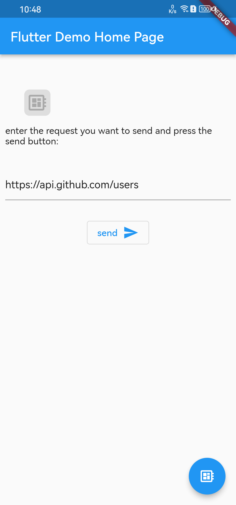
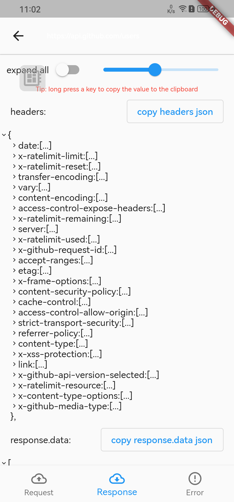
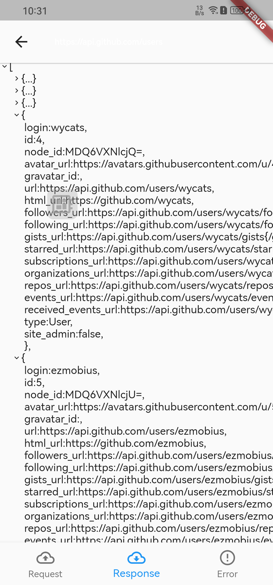

# dio_log_plus

[](https://pub.dev/packages/dio_log_plus)

Language: [English README](./README.md) | [中文简体 README](./README_zh.md)

HTTP Inspector tool for Dart which can debugging http requests，Currently, DIO based HTTP capture is implemented

Of course, you can implement an Interceptor instead of a DiologInterceptor to adapt to other HTTP clients

### Screenshot

|                   |                   |                   |                   |
| ----------------- | ----------------- | ----------------- | ----------------- |
|  |  |  |  |

### Add dependency

```yaml
dependencies:
  dio_log_plus: ^4
```

### set interceptor of dio

```dart
dio.interceptors.add(DioLogInterceptor());
```

### Add a global hover button on your home page to jump through the log list

```dart
///display overlay button
showDebugBtn(context,btnColor: Colors.blue);
///cancel overlay button
dismissDebugBtn();
///overlay button state of display
debugBtnIsShow()
```

### Or open a log list where you want it to be

```dart
Navigator.of(context).push(
    MaterialPageRoute(
      builder: (context) => HttpLogListWidget(),
    ),
  );
```

### Other configurable parameters

```dart
/// Sets the maximum number of entries for logging
LogPoolManager.getInstance().maxCount = 100;
///Add the isError method implementation to LogPoolManager so that request messages defined as errors are displayed in red font
LogPoolManager.getInstance().isError = (res) => res.resOptions==null;
///Disabling Log Printing
DioLogInterceptor.enablePrintLog = false;
```

## Thanks

[dio_log](https://pub.dev/packages/dio_log)
