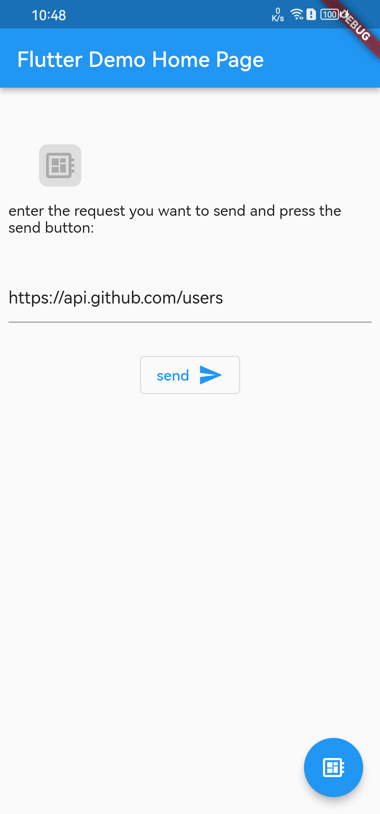
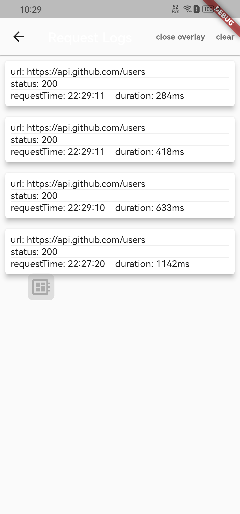
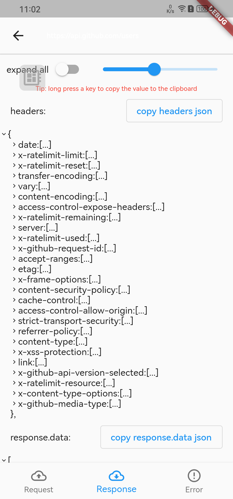
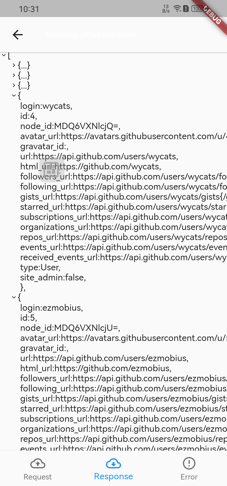

# dio_log_plus

[](https://pub.dev/packages/dio_log_plus)

Language: [English README](./README.md) | [中文简体 README](./README_zh.md)

flutter 的 HTTP 检查器工具，可以帮助调试 HTTP 请求，目前实现了基于 dio 的 http 捕获

当然你可以通过自己实现 Interceptor 来代替 DioLogInterceptor 来适配其他 Http client

### Screenshot

|                   |                   |                   |                   |
| ----------------- | ----------------- | ----------------- | ----------------- |
|  |  |  |  |

## 添加依赖

```yaml
dependencies:
  dio_log_plus: ^4
```

## 给 dio 设置监听

```dart
dio.interceptors.add(DioLogInterceptor());
```

## 在你的主页面添加全局的悬浮按钮，用于跳转日志列表

```dart
/// 显示悬浮按钮
showDebugBtn(context, btnColor: Colors.blue);
/// 取消悬浮按钮
dismissDebugBtn();
/// 悬浮按钮展示状态
debugBtnIsShow()
```

## 或者在你期望的地方打开日志列表

```dart
    Navigator.of(context).push(
      MaterialPageRoute(
        builder: (context) => HttpLogListWidget(),
      ),
    );
```

## 其他可设置参数

```dart
/// 设置记录日志的最大条数
LogPoolManager.getInstance().maxCount = 100;
/// 将isError方法实现添加到LogPoolManager，以便将定义为错误的请求消息显示为红色字体
LogPoolManager.getInstance().isError = (res) => res.resOptions==null;
/// 关闭打印
DioLogInterceptor.enablePrintLog = false;
```

## Thanks

[dio_log](https://pub.flutter-io.cn/packages/dio_log)
